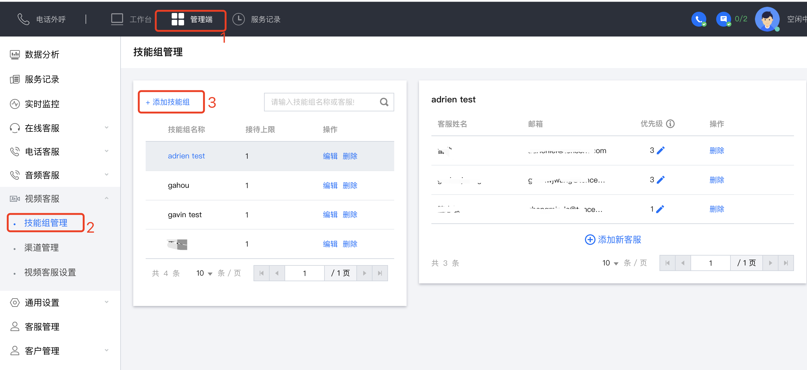
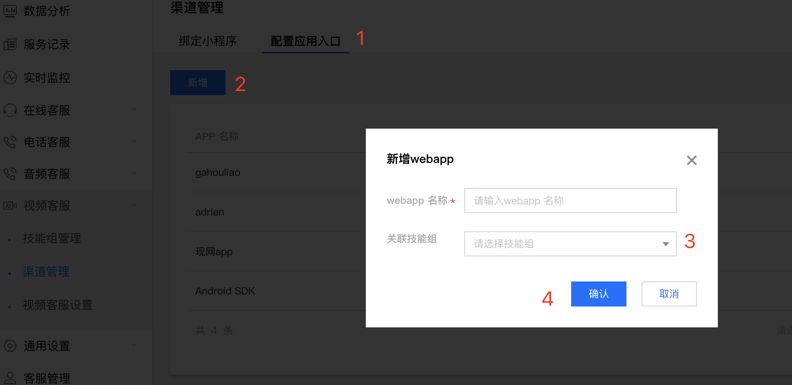
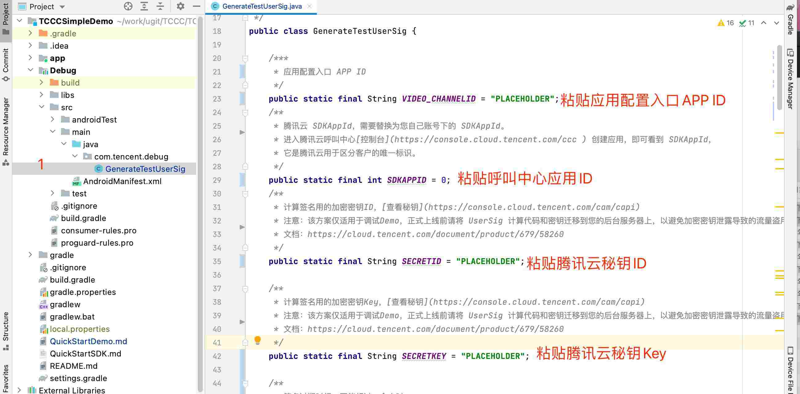
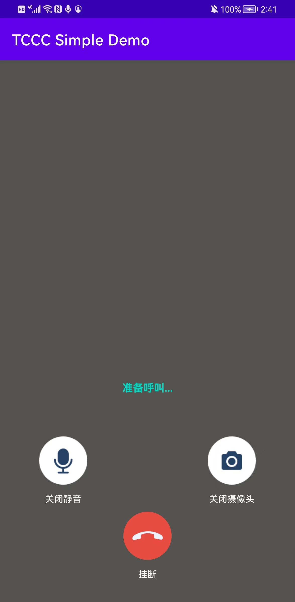
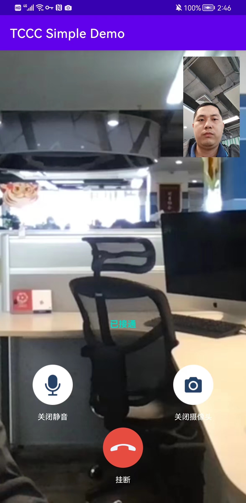

# 快速跑通用户端Android Demo

本文主要介绍如何快速跑通腾讯云呼叫中心访客端 Android TCCC Demo，只要按照如下步骤进行配置，就可以跑通访客端的 Android Demo。

## 开发环境要求
- Android Studio 3.5+。
- Android 4.1（SDK API 16）及以上系统。

## 前提条件
- 您已 [注册腾讯云](https://cloud.tencent.com/document/product/378/17985) 账号，并完成 [实名认证](https://cloud.tencent.com/document/product/378/3629) 。
- 您已 [开通云呼叫中心](https://cloud.tencent.com/document/product/679/48028#.E6.AD.A5.E9.AA.A41.EF.BC.9A.E5.87.86.E5.A4.87.E5.B7.A5.E4.BD.9C) 服务，并创建了 [云呼叫中心实例](https://cloud.tencent.com/document/product/679/48028#.E6.AD.A5.E9.AA.A42.EF.BC.9A.E5.88.9B.E5.BB.BA.E4.BA.91.E5.91.BC.E5.8F.AB.E4.B8.AD.E5.BF.83.E5.AE.9E.E4.BE.8B) 。

## 操作步骤

### 步骤1：配置视频客服
1. 登录 [呼叫中心管理端](https://tccc.qcloud.com/login)，选择**登录的呼叫中心** > **管理端** > **视频客服** > **技能组管理** > **添加技能组** 。

2. 添加 **新客服** 到对应的技能组中。

3. 新增**应用配置入口**。 选择**管理端** > **渠道管理** > **应用配置入口** > **新增** 。复制刚刚新建的 APP ID

### 步骤2：下载 SDK 和 TCCCSimpleDemo 源码
1. 根据实际业务需求 [TCCCSimpleDemo](https://github.com/TencentCloud/tccc-examples) 源码。

### 步骤3：配置 TCCCSimpleDemo 工程文件
1. 找到并打开 `Debug/src/main/java/com/tencent/debug/GenerateTestUserSig.java` 文件。
3. 设置 `GenerateTestUserSig.java` 文件中的相关参数：
	<ul>
  <li/>VIDEO_CHANNELID：请设置为实际的 应用配置入口 APP ID。
  <li/>SDKAPPID：请设置为实际的腾讯云呼叫中心 SDKAppID。
	<li/>SECRETID：请设置为实际的密钥ID信息。
  <li/>SECRETKEY：请设置为实际的密钥Key信息。
  </ul>

>!
>- 本文提到的生成 UserSig 的方案是在客户端代码中配置 SECRETID、SECRETKEY，该方法中 SECRETID、SECRETKEY 很容易被反编译逆向破解，一旦您的密钥泄露，攻击者就可以盗用您的腾讯云流量，因此**该方法仅适合本地跑通 TCCCSimpleDemo 和功能调试**。
>- 正确的 UserSig 签发方式是将 UserSig 的计算代码集成到您的服务端，并提供面向 App 的接口，在需要 UserSig 时由您的 App 向业务服务器发起请求获取动态 UserSig。更多详情请参见 [创建用户数据签名](https://cloud.tencent.com/document/product/679/58260)。

### 步骤4：编译运行
使用 Android Studio（3.5及以上的版本）打开源码工程 `TCCCSimpleDemo`，单击**运行**即可。

### 运行效果
基本功能如下图所示
| 呼叫中效果 | 接听效果 |
|-----|-----|
|||

